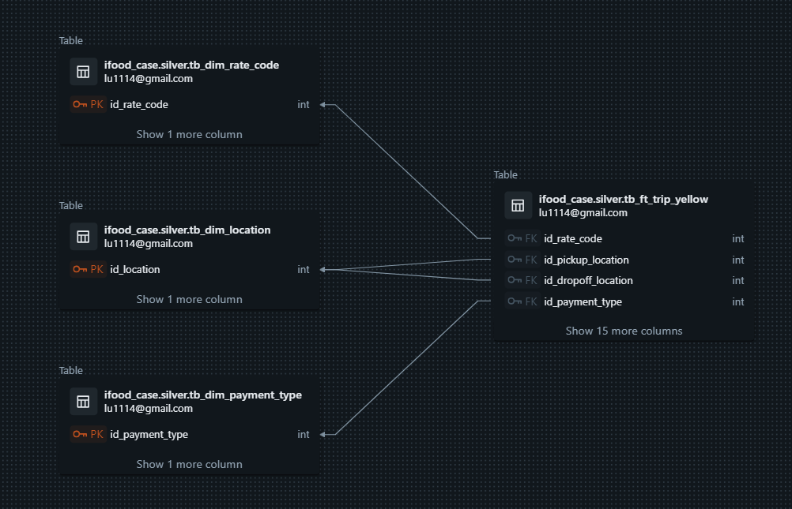
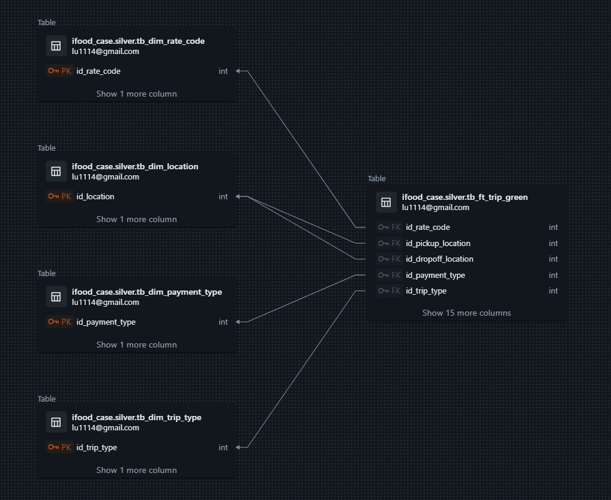
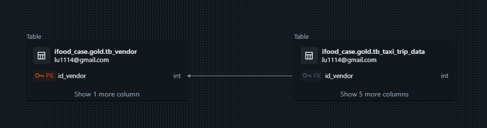
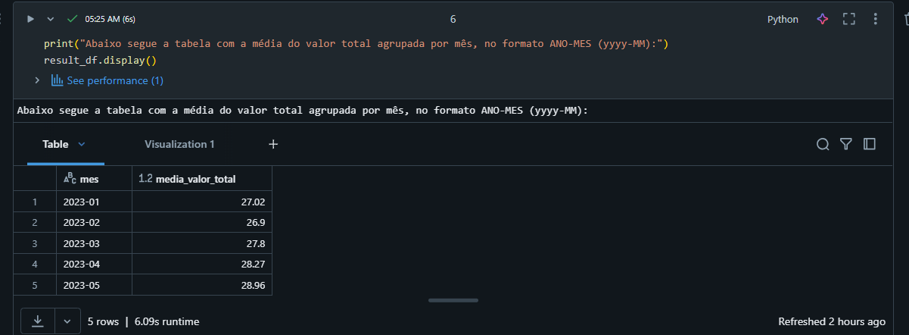
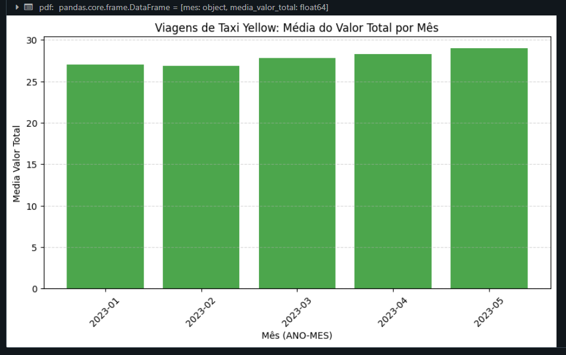
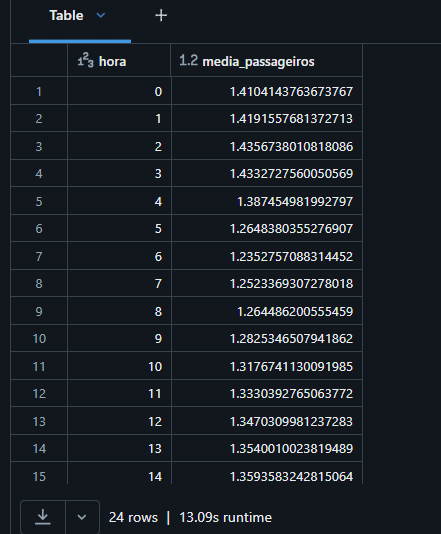
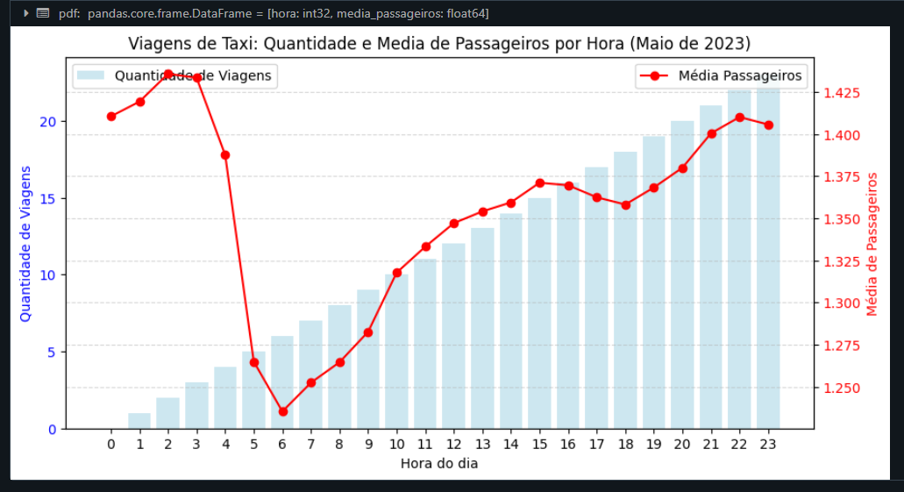

# # Case Técnico Data Architect - iFood: Dados de Viagens de Táxi

Este projeto consiste na proposta de solução de Case Técnico, onde utiliza os dados dos taxis de Nova York (https://www.nyc.gov/site/tlc/about/tlc-trip-record-data.page). 

Tudo foi desenvolvido dentro do Databricks, em versão NÃO COMMUNITY. 

O projeto está estruturado para processar os arquivos brutos de 2023-01 até 2023-05, transformá-los em tabelas nas camadas bronze e silver, e finalmente produzir dados no nível gold para análise.

Foram realizadas duas perguntas sobre os dados e as respostas também encontram dentro do projeto.


## Estrutura do Projeto

A estrutura do projeto é a seguinte:

```
/ifood-case
│
├── /analysis                # Análises gerais
│   ├── /eda                # Análise Exploratória de Dados (EDA)
│   │   ├── green_tripdata.ipynb # Notebook para análise exploratória dos dados de táxi do tipo GREEN
│   │   └── yellow_tripdata.ipynb # Notebook para análise exploratória dos dados de táxi do tipo YELLOW
│   └── /questions          # Perguntas
│       ├── perguntal.ipynb # Notebook para a primeira pergunta
│       └── pergunta2.ipynb # Notebook para a segunda pergunta
│
├── /src                     # Código fonte e scripts
│   ├── /bronze              # Camada Bronze - Dados brutos transformados
│   │   ├── _execute_all_bronze.ipynb # Notebook para executar todas as transformações da camada bronze
│   │   └── generic_raw_to_bronze.ipynb # Notebook para transformar dados brutos em bronze de acordo com parâmetros passados (chamado peelo _execute_all_bronze)
│   ├── /gold                # Camada Gold - Dados finais para análise
│   │   ├── /metadata         # Pasta com os arquivos de metadados para cada tabela da camada gold
│   │   │   ├── tb_taxl_trip_data.yaml # Arquivo de configuração YAML para dados de viagens de táxi
│   │   │   └── tb_vendor.yaml   # Arquivo de configuração YAML para dados de fornecedores dos registros
│   │   ├── _execute_all_gold.ipynb # Notebook para executar todas as transformações da camada gold
│   │   ├── tb_taxl_trip_data.ipynb # Notebook para produzir dados no nível gold (viagens de táxi)
│   │   └── tb_vendor.ipynb  # Notebook para produzir dados no nível gold (fornecedores)
│   ├── /raw                 # Dados brutos
│   │   └── all_source_to_raw.ipynb # Notebook para ingestão de todos os dados brutos
│   └── /silver              # Camada Silver - Dados processados
│       ├── /metadata         # Pasta com os arquivos de metadados para cada tabela da camada silver
│       │   ├── tb_dim_location.yaml # Arquivo de configuração YAML para dimensão de localização
│       │   ├── tb_dim_payment_type.yaml # Arquivo de configuração YAML para dimensão de tipo de pagamento
│       │   ├── tb_dim_rate_code.yaml # Arquivo de configuração YAML para dimensão de código de tarifa
│       │   ├── tb_dim_trip_type.yaml # Arquivo de configuração YAML para dimensão de tipo de viagem
│       │   ├── tb_dim_vendor.yaml # Arquivo de configuração YAML para dimensão de fornecedor
│       │   ├── tb_ft_trip_green.yaml # Arquivo de configuração YAML para fatos de viagens green
│       │   └── tb_ft_trip_yellow.yaml # Arquivo de configuração YAML para fatos de viagens yellow
│       ├── _execute_all_silver.ipynb # Notebook para executar todas as transformações da camada silver
│       ├── bronze_to_silver_tb_ft_trip_green.ipynb # Notebook para transformar dados bronze em silver (viagens de táxi do tipo GREEN)
│       ├── bronze_to_silver_tb_ft_trip_yellow.ipynb # Notebook para transformar dados bronze em silver (viagens de táxi do tipo YELLOW)
│       ├── tb_dim_location.ipynb # Notebook para dimensão de localização
│       ├── tb_dim_payment_type.ipynb # Notebook para dimensão de tipo de pagamento
│       ├── tb_dim_rate_code.ipynb # Notebook para dimensão de código de tarifa
│       ├── tb_dim_trip_type.ipynb # Notebook para dimensão de tipo de viagem
│       └── tb_dim_vendor.ipynb # Notebook para dimensão de fornecedor
│
├── /utils                   # Utilitários e scripts auxiliares
│      └── utils.py # Script com métodos de criação/atualização de metadados
│
├── README.md                # Documentação do projeto
└── requirements.txt         # Lista de dependências do projeto
```

## Começando

### Pré-requisitos

- Workspace do Databricks com o Unity Catalog habilitado
- Cluster com a versão 3.5.2 do Spark
- Acesso às fontes de dados necessárias
- Ambiente Python com as bibliotecas necessárias (veja `requirements.txt`)

### Instalação

1. Clone este repositório para o seu workspace no Databricks.
2. Certifique-se de que todas as bibliotecas necessárias estão instaladas executando o seguinte comando em um notebook do Databricks:

   ```python
   %pip install -r requirements.txt
   ```
*(Os requirements geralmente já estão instalados por default no cluster)*


### Configuração de Localização Externa para S3

Para configurar uma localização externa no Amazon S3, siga os passos abaixo:

#### 1. Criar uma Credencial de Armazenamento
Primeiro, crie uma credencial de armazenamento para acessar o S3 (substitua o AWS_ROLE_ARN):

```sql
CREATE STORAGE CREDENTIAL IF NOT EXISTS my_s3_credential
WITH TYPE = 's3',
LOCATION = 's3://case-tecnico-ifood',
AWS_ROLE_ARN = 'arn:aws:iam::123456789012:role/your-role-name';
```

#### 2. Criar uma Localização Externa
Em seguida, crie uma localização externa que utilize a credencial de armazenamento:

```sql
CREATE EXTERNAL LOCATION IF NOT EXISTS my_s3_location
URL 's3://case-tecnico-ifood'
WITH (STORAGE CREDENTIAL = my_s3_credential);
```

#### 3. Conceder Permissões (Opcional)
Se necessário, conceda permissões para a localização externa:

```sql
GRANT READ ON EXTERNAL LOCATION my_s3_location TO `<user_or_group>`;
GRANT WRITE ON EXTERNAL LOCATION my_s3_location TO `<user_or_group>`;
```

### Configuração do Catálogo e Esquemas

Para organizar os dados em camadas (bronze, silver, gold), é necessário criar um catálogo e esquemas no Databricks. Execute os seguintes comandos SQL em um notebook do Databricks:

#### 1. Criar o Catálogo
```sql
CREATE CATALOG IF NOT EXISTS ifood_case;
```

#### 2. Criar Esquemas para Cada Camada
```sql
-- Esquema para a camada Bronze
CREATE SCHEMA IF NOT EXISTS ifood_case.bronze
WITH LOCATION 's3://case-tecnico-ifood/bronze';

-- Esquema para a camada Silver
CREATE SCHEMA IF NOT EXISTS ifood_case.silver
WITH LOCATION 's3://case-tecnico-ifood/silver';

-- Esquema para a camada Gold
CREATE SCHEMA IF NOT EXISTS ifood_case.gold
WITH LOCATION 's3://case-tecnico-ifood/gold';
```

#### 3. Definir Permissões (Opcional)
Se necessário, você pode definir permissões para os esquemas:
```sql
-- Conceder permissões para um usuário ou grupo
GRANT USAGE ON CATALOG ifood_case TO `<user_or_group>`;
GRANT USAGE ON SCHEMA ifood_case.bronze TO `<user_or_group>`;
GRANT USAGE ON SCHEMA ifood_case.silver TO `<user_or_group>`;
GRANT USAGE ON SCHEMA ifood_case.gold TO `<user_or_group>`;
```

---

## Escolhas Técnicas

Abaixo seguem as justificativas para as principais decisões técnicas:

### 1. **Databricks como Plataforma Principal**
   - **Por que Databricks?**
     - Além de ter sido uma sugestão do Case, é uma plataforma que gosto de trabalhar e acho que o desenvolvimento é bem mais rápido, pois oferece um ambiente unificado e notebooks fáceis de trabalhar e visualizar dados.

### 2. **Armazenamento em Amazon S3**
   - **Por que S3?**
     - Além de ter sido uma sugestão do Case, acredito que um storage pra dados estruturados e não estruturados é a melhor escolha.
     - Permite armazenar grandes volumes de dados de forma barata e de fácil maanipulação.
     - Integração fácil com o Databricks.

### 3. **Arquitetura em Camadas (Bronze, Silver, Gold)**
   - Estou acostumada a trabalhar com a arquitetura medalhão e acho muito eficiente e de fácil organização dos dados, com cada camada tendo sua responsabilidade.
   - **Raw**: Armazena dados brutos sem transformações, no formato de dados da fonte, mantendo a fidelidade dos dados originais. Muito importante para o caso de ser necessário reprocessar os dados de determinada ingestão e validar o que realmente foi carregado.
   - **Bronze**: Dados brutos sem transformações, mas salvo em tabelas.
   - **Silver**: Dados são limpos, normalizados e transformados em tabelas de dimensões e fatos.
   - **Gold**: Dados são agregados e preparados para análise, de acordo com a necessidade de negócio.
   - **Benefícios**:
     - Separação clara das responsabilidades em cada camada.
     - Facilita a reprodutibilidade e a manutenção do pipeline.

### 4. **Uso de Tabelas Delta**
   - **Por que tabelas Delta?**
     - Com tabelas Delta é possível versionar os dados e navegar entre as versões.
     - É possível integrar diretamente com Power BI.
     - ACID
     - Otimização para grande volume de dados.

### 5. **Metadados em Arquivos YAML**
   - **Por que YAML?**
     - YAML é um formato legível e fácil de usar para definir metadados.
     - Permite a descrição da estrutura das tabelas, tipos de dados e comentários de forma organizada.
     - Facilita a documentação e a manutenção do esquema de dados.

### 6. **Padrões de Nomenclatura**
   - **Camada Silver**: Nomes de campos em inglês e no formato `snake_case` para facilitar a colaboração internacional.
   - **Camada Gold**: Nomes de campos em português para facilitar a compreensão pela equipe local e stakeholders.
   - **Benefícios**:
     - Consistência na nomenclatura.
     - Facilita a interpretação dos dados por diferentes equipes.

---


## Modelagem de Dados (Silver e Gold)

A modelagem de dados nas camadas **Silver** e **Gold** segue o padrão Fato/Dimensão. Abaixo está um diagrama que ilustra a estrutura das tabelas nas camadas Silver e Gold:

  
  
  
*(Diagramas gerados dentro do próprio databricks devido ao fato de utilização de constraints de PK e FK nas tabelas)*

### Camada Silver
Na camada **Silver**, os dados são transformados em tabelas normalizadas, com foco em dimensões e fatos. As tabelas principais incluem:
- **Dimensões**: `tb_dim_location`, `tb_dim_payment_type`, `tb_dim_rate_code`, `tb_dim_trip_type`, `tb_dim_vendor`.
- **Fatos**: `tb_ft_trip_green`, `tb_ft_trip_yellow`.

### Camada Gold
Na camada **Gold**, os dados são agregados e preparados para análise. As tabelas principais incluem:
- **Tabelas de Análise**: `tb_taxl_trip_data`, `tb_vendor`.

---

## Metadados e Padrões de Nomenclatura

### Metadados
Os metadados são armazenados em arquivos YAML para cada tabela, descrevendo a estrutura, tipos de dados, tags, fk, pk e comentários. Exemplos de arquivos de metadados:
- **Silver**: `tb_dim_location.yaml`, `tb_ft_trip_green.yaml`.
- **Gold**: `tb_taxl_trip_data.yaml`, `tb_vendor.yaml`.

### Padrões de Nomenclatura
- **Camada Silver**:
  - Tabelas de dimensões: `tb_dim_<nome_da_dimensão>`.
  - Tabelas de fatos: `tb_ft_<nome_do_fato>`.
  - Campos: Nomes em inglês, seguindo o padrão `snake_case` (ex: `id_payment_type`, `vl_total_amount`) e com prefixo de acordo com o tipo de dado.
  - Comentários: Em inglês, descrevendo o propósito de cada campo.

- **Camada Gold**:
  - Tabelas: `tb_<nome_da_tabela>`.
  - Campos: Nomes em inglês, seguindo o padrão `snake_case` (ex: `id_payment_type`, `vl_total_amount`) e com prefixo de acordo com o tipo de dado.
  - Comentários: Em português, descrevendo o propósito de cada campo.

---

## Uso de Idiomas nos Comentários

- **Camada Silver**: Os comentários dos campos e tabelas estão em **inglês**, seguindo boas práticas de documentação para facilitar a colaboração internacional.
- **Camada Gold**: Os comentários dos campos e tabelas estão em **português**, para facilitar a compreensão pela equipe local e stakeholders.

---

### Execução

1. **Ingestão de Dados Brutos**:
   - Execute o notebook `all_source_to_raw.ipynb` para ingerir os dados brutos das fontes.
   - Caso seja necessário trocar o nome do bucket utilizado, é necessário alterar no notebook a variável `base_s3_bucket`.

2. **Transformação para a Camada Bronze**:
   - Use o notebook `_execute_all_bronze.ipynb` para executar todas as transformações da camada bronze.
   - Caso deseje executar individualmente a ingestão de cada tabela, execute o notebook `generic_raw_to_bronze.ipynb` com os devidos parâmetros.
  - Caso seja necessário trocar o nome do bucket utilizado, é necessário alterar no notebook `generic_raw_to_bronze.ipynb` a `variável s3_path`.

3. **Transformação para a Camada Silver**:
   - Execute o notebook `_execute_all_silver.ipynb` para executar todas as transformações da camada silver.

4. **Transformação para a Camada Gold**:
   - Execute o notebook `_execute_all_gold.ipynb` para executar todas as transformações da camada gold.

5. **Análise Exploratória de Dados (EDA)**:
   - Utilize os notebooks na pasta `analysis/eda` (`green_tripdata.ipynb` e `yellow_tripdata.ipynb`) para realizar análises exploratórias dos dados.

6. **Perguntas**:
   - Utilize os notebooks na pasta `analysis/questions` (`perguntai.ipynb` e `pergunta2.ipynb`) para verificar as respostas para as perguntas realizadas no case.
   - Foi incluída uma célula final em cada notebook que plota um gráfico com os dados. Este passo é apenas opcional visto que é possível criar os gráficos pelo próprio Databricks, acrescentando um tipo de visualização nas células.

   - **Resposta Pergunta 1**:

      ##### Média do Valor Total por Mês

      | Mês      | Média do Valor Total |
      |----------|----------------------|
      | 2023-01  | 27.02                |
      | 2023-02  | 26.90                |
      | 2023-03  | 27.80                |
      | 2023-04  | 28.27                |
      | 2023-05  | 28.96                |


   
   

   - **Resposta Pergunta 2**:

      ##### Média de Passageiros por Hora

      | Hora | Média de Passageiros |
      |------|----------------------|
      | 0    | 1.4104              |
      | 1    | 1.4192              |
      | 2    | 1.4357              |
      | 3    | 1.4333              |
      | 4    | 1.3875              |
      | 5    | 1.2648              |
      | 6    | 1.2353              |
      | 7    | 1.2523              |
      | 8    | 1.2645              |
      | 9    | 1.2825              |
      | 10   | 1.3177              |
      | 11   | 1.3330              |
      | 12   | 1.3470              |
      | 13   | 1.3540              |
      | 14   | 1.3594              |
      | 15   | 1.3710              |
      | 16   | 1.3695              |
      | 17   | 1.3624              |
      | 18   | 1.3581              |
      | 19   | 1.3682              |
      | 20   | 1.3799              |
      | 21   | 1.4004              |
      | 22   | 1.4100              |
      | 23   | 1.4056              |

   *(Os valores foram arredondados para quatro casas decimais para melhor visualização.)*

   
   
